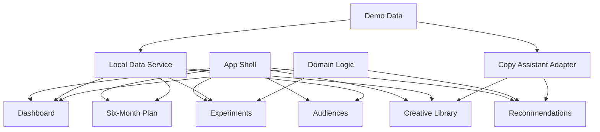

# Growth Lab Command Center Plan

## Summary

Build Growth Lab as a demo-first local web app for a small arts retail brand that needs to turn organic reach, visual content, seasonal online sales, and a tiny ad budget into repeatable growth experiments. The first version should be polished enough to show as a portfolio project and structured enough to support later real integrations.

---

## Problem Frame

The source research describes a brand with an established physical shop, 13,000+ social followers, strong December online sales, weak online marketing the rest of the year, a 6-month test horizon, a month 1 audit phase, a small paid budget from month 2 onward, and a need for autonomous systems that can scale beyond the initial test.

The product opportunity is not "make a marketing dashboard." The stronger build is an operating tool that helps one stretched operator decide what to try, run experiments, measure growth against last year, reuse brand visuals, and explain what is working.

---

## Requirements

**Core Operating System**

- R1. The app must make the first screen a working dashboard, not a landing page.
- R2. The app must represent a 6-month growth program with month 1 focused on audit and organic work, then months 2-6 focused on channel tests and scaling what works.
- R3. The app must support a weekly operator view that identifies the highest-priority actions, stalled work, and tests worth scaling.
- R4. The app must use realistic seeded demo data so the product can be evaluated before real integrations exist.

**Growth Measurement**

- R5. The app must compare current monthly online sales against the same month last year.
- R6. The app must calculate a 25 percent growth threshold over the same month last year.
- R7. The app must calculate commissionable revenue and reward using the rule: 15 percent of monthly sales above the 25 percent growth threshold.
- R8. The app must show December as a meaningfully different seasonal context from weaker non-December months.

**Campaigns And Experiments**

- R9. The app must let the operator track experiments by hypothesis, channel, audience, creative, spend, metric, result, confidence, and next action.
- R10. The app must distinguish organic activity from paid activity and reflect a small paid budget from month 2 onward.
- R11. The app must show campaign status and experiment outcomes in a way that makes stop, iterate, and scale decisions obvious.

**Audience And Creative Strategy**

- R12. The app must include audience segments grounded in the brand context, such as local supporters, gift buyers, collectors, design/homeware shoppers, tourists, and community-aligned customers.
- R13. The app must include a creative/content library that can connect product imagery, campaign themes, captions, and reuse notes.
- R14. The app must generate or mock campaign copy, caption ideas, email concepts, bundle ideas, and weekly recommendations from brand context and experiment data.

**Implementation Quality**

- R15. The first version must keep real commerce, analytics, ads, social, email, and AI integrations behind service boundaries or adapters.
- R16. The UI must be dense, practical, and work-focused, with predictable navigation and no oversized marketing hero as the primary experience.
- R17. The app must include focused tests for growth math and experiment/recommendation domain logic.
- R18. The implementation must be verified with a local dev server and browser review before being considered complete.

---

## Key Technical Decisions

- KTD1. Demo-first local app: Use realistic mock data for the first version so the hard product workflow can be built and inspected before external API complexity arrives.
- KTD2. Frontend-first TypeScript architecture: Start with a modern TypeScript web app and pure domain modules. This keeps growth math, experiment state, and recommendation logic testable outside the UI.
- KTD3. Adapter boundaries for integrations: Model future commerce, analytics, ads, social, email, and AI services as replaceable adapters from the start, but implement local demo adapters first.
- KTD4. Workflow navigation over marketing layout: The first viewport should be the dashboard/operator surface. Navigation should privilege repeated work: Dashboard, Plan, Experiments, Audiences, Creative, Recommendations.
- KTD5. Deterministic AI-assistant fallback: Use deterministic mock generation first so the experience is useful without API keys. A later AI provider can replace the generator through the same interface.
- KTD6. Growth math as domain logic: Put year-over-year comparison, threshold, and commission calculations in test-covered domain files rather than embedding them in visual components.

---

## High-Level Technical Design

The first implementation should keep data loading, domain logic, and UI separate. Components can consume typed view models produced by local services. Future external integrations can replace the local services without rewriting the product surface.

---

## Implementation Units

### U1. Project Scaffold And Design Baseline

- **Goal:** Create the web app scaffold, establish the development commands, and build the first app shell with navigation.
- **Files:** `package.json`, `index.html`, `src/main.tsx`, `src/App.tsx`, `src/styles.css`, `src/components/AppShell.tsx`, `src/pages/DashboardPage.tsx`, `README.md`
- **Patterns:** Use a local, frontend-first structure. Keep the first route as the dashboard rather than a marketing page.
- **Test Scenarios:** Verify the app starts locally, renders the app shell, and presents dashboard-first navigation without console errors.
- **Verification:** Run the dev server, open the app in the browser, and update README with actual commands.

### U2. Demo Data And Domain Model

- **Goal:** Define typed seed data and pure domain logic for sales, campaigns, experiments, audiences, creative assets, and recommendations.
- **Files:** `src/data/demoData.ts`, `src/domain/growth.ts`, `src/domain/experiments.ts`, `src/domain/recommendations.ts`, `src/types.ts`, `tests/growth.test.ts`, `tests/experiments.test.ts`
- **Patterns:** Domain functions should be deterministic and independent of React.
- **Test Scenarios:** Confirm threshold and commission math; confirm experiment next-action classification; confirm seeded data covers month 1 and months 2-6.
- **Verification:** Run focused unit tests for domain logic.

### U3. Growth Dashboard

- **Goal:** Build the main operator dashboard with monthly sales comparison, growth threshold, commissionable amount, campaign status, active experiments, and weekly priorities.
- **Files:** `src/pages/DashboardPage.tsx`, `src/components/GrowthSummary.tsx`, `src/components/MonthComparison.tsx`, `src/components/ExperimentSnapshot.tsx`, `src/components/WeeklyActions.tsx`, `tests/growth.test.ts`
- **Patterns:** Use dense, scannable panels and tables. Avoid decorative cards nested inside cards.
- **Test Scenarios:** Show current month, previous-year baseline, 25 percent threshold, commissionable amount, and active recommendations from demo data.
- **Verification:** Browser review at desktop and mobile widths.

### U4. Campaign Planner And Six-Month Timeline

- **Goal:** Build a planning view that maps audit, organic tests, paid tests, checkpoint, and scale decisions across six months.
- **Files:** `src/pages/PlanPage.tsx`, `src/components/SixMonthTimeline.tsx`, `src/components/CampaignPlanTable.tsx`, `src/domain/planning.ts`, `tests/planning.test.ts`
- **Patterns:** Month 1 should be organic/audit-heavy; months 2-6 should expose the small paid budget and channel tests.
- **Test Scenarios:** Confirm the plan view shows month-specific budget posture and checkpoint moments.
- **Verification:** Browser review for readable timeline at narrow and wide viewports.

### U5. Experiment Board

- **Goal:** Build an experiment tracker where the operator can review hypotheses, audiences, channels, creative, spend, result, confidence, and next action.
- **Files:** `src/pages/ExperimentsPage.tsx`, `src/components/ExperimentBoard.tsx`, `src/components/ExperimentDetail.tsx`, `src/domain/experiments.ts`, `tests/experiments.test.ts`
- **Patterns:** Make stop, iterate, and scale decisions visually clear. Filters should use segmented controls or menus where appropriate.
- **Test Scenarios:** Confirm experiments can be grouped by status and next action; confirm paid and organic tests are distinguishable.
- **Verification:** Unit tests plus browser review.

### U6. Audiences, Creative Library, And Copy Assistant

- **Goal:** Build audience and creative surfaces, then connect them to a deterministic assistant that generates campaign copy and weekly suggestions from seeded context.
- **Files:** `src/pages/AudiencesPage.tsx`, `src/pages/CreativePage.tsx`, `src/components/AudienceSegmentList.tsx`, `src/components/CreativeLibrary.tsx`, `src/services/copyAssistant.ts`, `tests/recommendations.test.ts`
- **Patterns:** The assistant should cite the segment, product/theme, and campaign goal it used. Avoid generic marketing suggestions.
- **Test Scenarios:** Confirm each generated suggestion is grounded in an audience segment and creative asset; confirm recommendations are stable for the same inputs.
- **Verification:** Unit tests for generation logic and browser review of the UI.

### U7. Polish, Responsive QA, And Portfolio Readiness

- **Goal:** Refine the UI, verify responsiveness, fix layout issues, and make the app presentable as a portfolio project.
- **Files:** `src/styles.css`, page/component files touched by U1-U6, `README.md`, `templates/test-plan.md`
- **Patterns:** Use compact typography inside operational panels, stable dimensions for dashboard tiles, icons in tool buttons where available, and responsive layouts that preserve readability.
- **Test Scenarios:** Confirm no text overlaps at mobile or desktop widths; confirm navigation and core views remain usable; confirm README explains what the app does and how to run it.
- **Verification:** Run tests, build, and browser screenshots across desktop and mobile.

---

## Acceptance Examples

- AE1. Given previous-year monthly online sales of 2000 and current sales of 3000, when the dashboard calculates reward, then the 25 percent threshold is 2500, commissionable revenue is 500, and reward is 75.
- AE2. Given the operator is viewing month 1, when the planner displays the campaign posture, then it emphasizes audit, organic analysis, and planning rather than paid budget deployment.
- AE3. Given an experiment has low confidence and weak result metrics, when it appears on the experiment board, then its next action should be stop or iterate rather than scale.
- AE4. Given a creative asset is linked to a gift-buyer audience and a product bundle, when the assistant generates copy, then the suggestion should reference that audience and bundle rather than generic brand language.
- AE5. Given a narrow mobile viewport, when the user opens the dashboard, then metrics, actions, and navigation remain readable without text overlap.

---

## Scope Boundaries

**In Scope For First Version**

- Local web app with mocked data.
- Dashboard, six-month plan, experiments, audiences, creative library, and recommendations.
- Test-covered domain logic for growth, reward, and experiment decisions.
- Browser-verified responsive UI.

**Deferred For Later**

- Real Shopify, GA4, Meta Ads, Instagram, email, or AI provider integrations.
- Authentication, roles, teams, billing, or production deployment.
- Persistent database beyond local/demo storage.
- Real image upload, asset storage, or account-level data permissions.

**Outside This Product's Identity**

- Job application preparation.
- Generic social media content scheduler.
- Enterprise marketing automation suite.
- A static marketing strategy document without an operating workflow.

---

## Risks And Dependencies

- Real integrations may introduce authentication, rate limits, privacy, and data-shape complexity. Keep adapters narrow before adding them.
- AI-generated recommendations can become generic. Ground every suggestion in seeded brand data, audience segments, creative assets, or experiment outcomes.
- The dashboard can sprawl. Prioritize operator decisions over decorative analytics.
- Package choices should be checked against current official docs at implementation time before installing.

---

## Sources

- `../../01_research/Online Marketer Needed - PRSC Job Post.txt`
- `docs/00-project-brief.md`
- `docs/03-decision-log.md`
- `docs/04-architecture.md`
